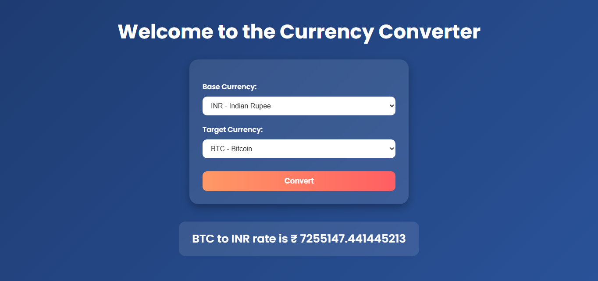
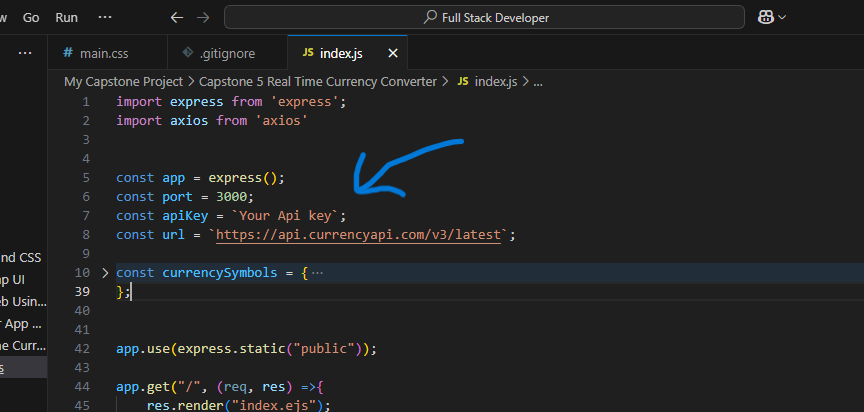

# 🌦️ Currency Converter App

Welcome to the **Currency Converter App** — a sleek, animated web application that lets you convert between global **currencies and cryptocurrencies**.

> Built with **Node.js**, **Express**, **EJS**, and **Vanilla CSS** (no Bootstrap/Tailwind).

---

## 🌍 Features

- 🔁 Convert between **100+ major currencies and top cryptocurrencies**.
- 💱 Supports INR, USD, EUR, GBP, BTC, ETH, DOGE, and more.
- ⚡️ Live exchange rates powered by a currency API.
- 🎨 Beautiful UI.
- 🌈 Smooth animations and modern feel.
- 📱 Fully responsive on desktop, tablet, and mobile.

---

## 📸 Preview



---

## 🚀 Getting Started

### 1. Clone the repository

```bash
git clone https://github.com/ayushverma2909/currency-converter-app.git
cd currency-converter-app

```
---

- Make sure to add your API Key from the (https://currencyapi.com/) in the index.js

